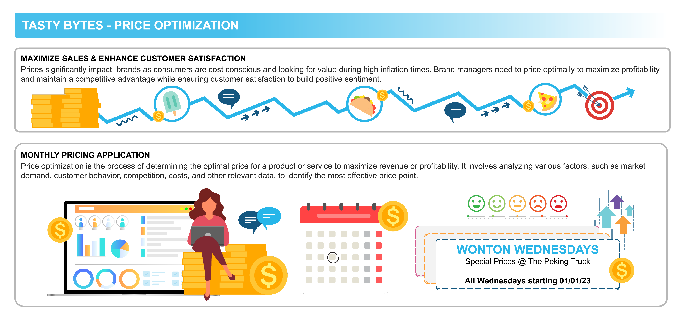

# Price Optimization using Snowflake Notebooks and Streamlit in Snowflake

## Overview

### Solution Business Scenario
- Tasty Bytes is one of the largest food truck networks in the world with localized menu options spread across 15 food truck brands globally. Tasty Bytes is aiming to achieve 25% YoY sales growth over 5 years. Price optimization enables Tasty Bytes to achieve this goal by determining the right prices for their menu items to maximize profitability while maintaining customer satisfaction. In this vignette, we will implement price optimization for their diversified food-truck brands to inform their pricing and promotions.

### What does this Solution Aim to Solve
- Train & deploy an ML model to understand how menu-item demand changes with varying price.
- User-friendly application to use deployed ML-model to inform pricing strategies.

## Step-By-Step Guide
For prerequisites, environment setup, step-by-step guide and instructions, please refer to the [QuickStart Guide](https://quickstarts.snowflake.com/guide/tasty_bytes_price_optimization_using_snowflake_notebooks_and_streamlit/index.html?index=..%2F..index#0)
